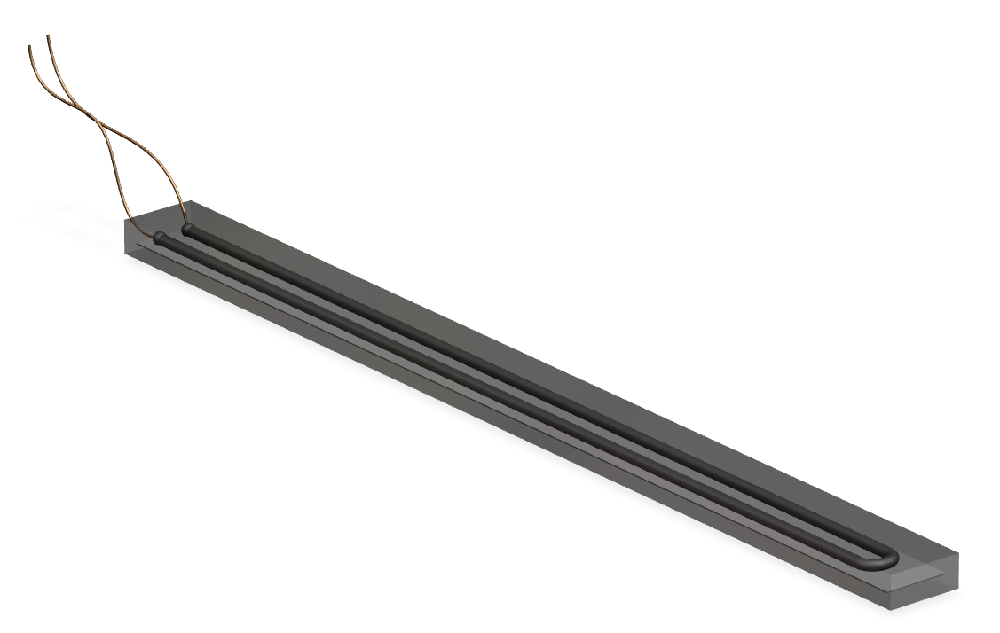

# Soft-Bending-Sensor-Design
Conductive ink embedded soft bending sensor design and Unity3D interface.

This project includes the design, manufacturing, and 3D simulation of a soft bending sensor. 3D design and mold models are saved in the 3D design folder. Molds are 3D printed and the liquid silicone casting (Ecoflex 00-30) method is used to create sensor design. Conductive carbon ink is injected onto the flexible substrate which works as the resistive and conductive element of the sensor, and the substrate is sandwiched between two layers of Ecoflex. Arduino micro is used for the data collection and the circuit diagram can be found below (5k resistor is used in the circuit). Gathered data is then sent to Unity by COM Port for 3D simulation of the sensor.

*3D model of the soft sensor;

*Example Circuit Set-up;

*Youtube demonstration;
https://www.youtube.com/watch?v=eRRuoDtD7dg
